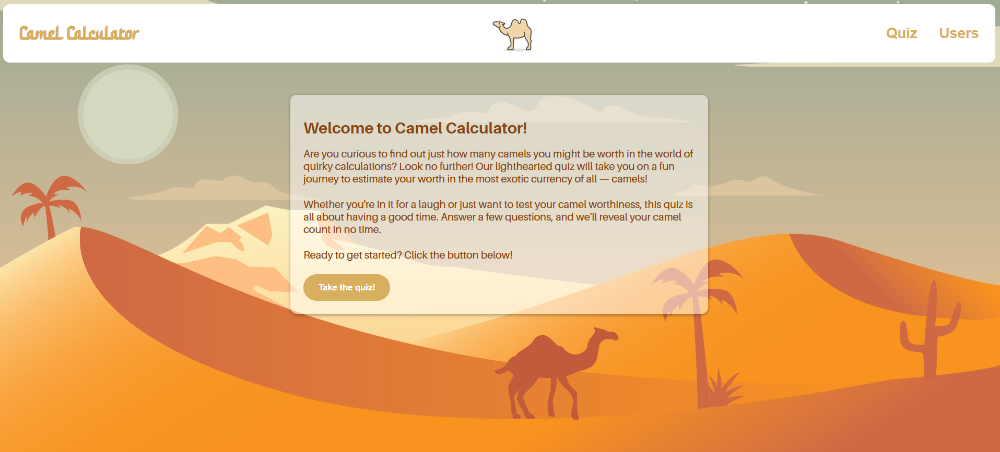
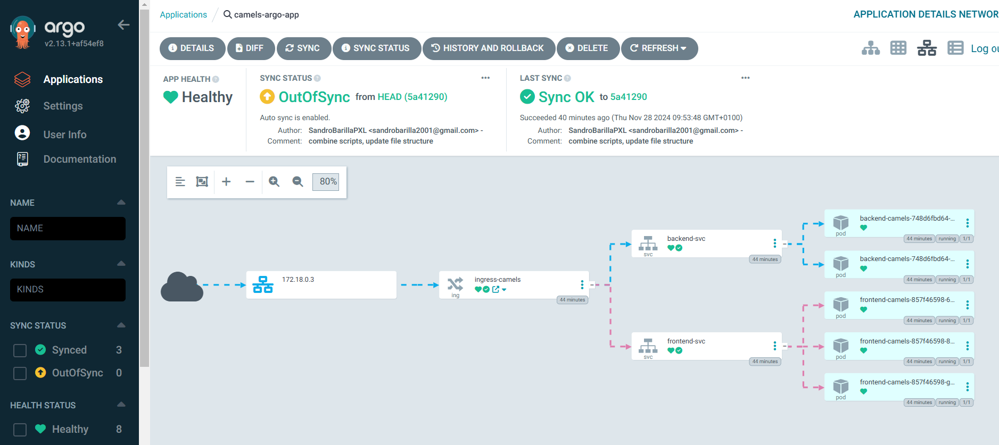
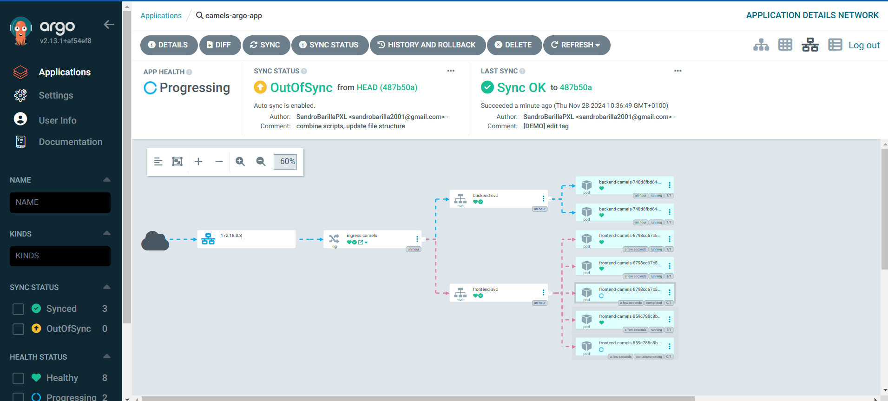
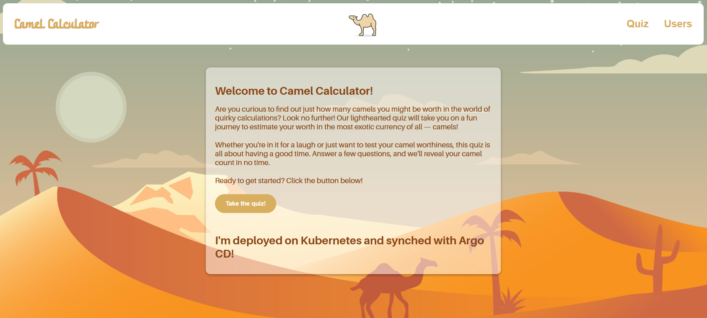
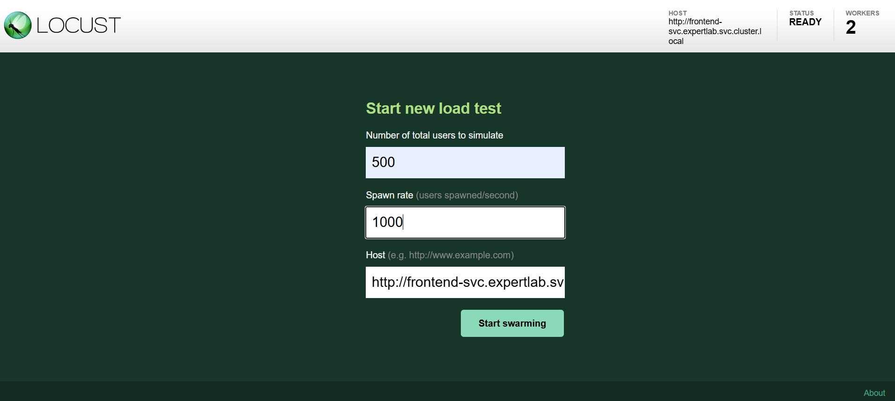
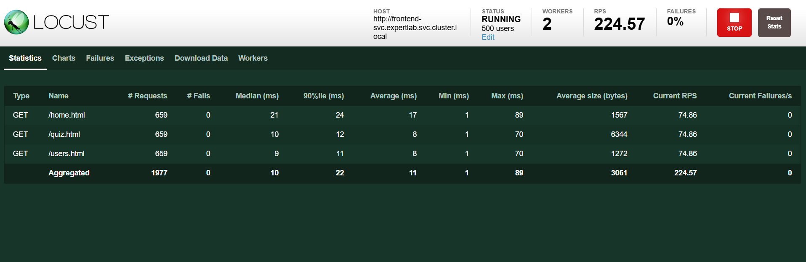
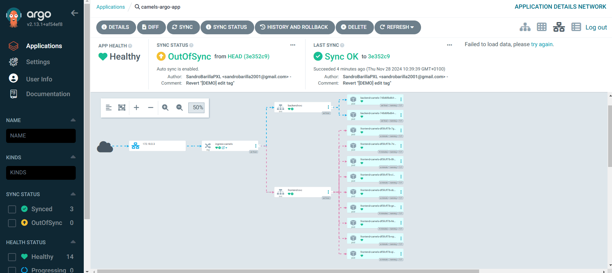

# expertlab-sprint4-kubernetes
This repository serves as a PoC of Kubernetes and GitOps

## :computer: App: Camel Counter (Web II Course Project, 2023)
This full stack app is a simple quiz to calculate the number of camels a person is worth. Original source files and documentation can be found [here](https://github.com/EHB-MCT/web2-course-project-front-end-SandroBarillaPXL) and [here](https://github.com/EHB-MCT/web2-course-project-back-end-SandroBarillaPXL). Slight adjustments were made to the original code to make it work in a containerised environment.
<br>

## :file_cabinet: Kubernetes and GitOps
This project demonstrates the use of Kubernetes and GitOps to deploy the Camel Counter app. Kubernetes is a container orchestration platform that automates the deployment, scaling and management of containerised applications. A cluster consists of different nodes, such as the master node and worker nodes. The master node controls the cluster and the worker nodes run the applications. Kubernetes uses objects to define the desired state of the cluster. These objects are stored in manifest files, which are then applied to the cluster using `kubectl apply -f <file>`. The cluster then tries to match the current state with the desired state. If the current state does not match the desired state, Kubernetes will try to reconcile the difference. This is done by creating, updating or deleting objects. These clusters are thus self-healing and self-managing, among many other features. `kubectl` is the command line tool used to interact with the cluster, but a tool like Lens is always handy for monitoring the cluster.

### :wrench: Prerequisites
- [ ] [Docker](https://docs.docker.com/get-docker/) (if you want to use K3d for local testing)
- [ ] [K3d](https://k3d.io/stable/#releases) (for local Kubernetes clusters running in Docker)
- [ ] [Kubectl](https://kubernetes.io/docs/tasks/tools/install-kubectl/) (for interacting with Kubernetes clusters)
- [ ] [Argo CD](https://argo-cd.readthedocs.io/en/stable/getting_started/) (for GitOps)
- [ ] [Lens](https://k8slens.dev/download) (optional, for monitoring the cluster)
- [ ] Fill in your GitHub Access token at [argocd/gh_pat_here.txt](argocd/gh_pat_here.txt) and rename it to `gh_pat.txt`
- [ ] Fill in your MongoDB password at [k8s/secrets_example.yml](k8s/secrets_example.yml) and rename it to `secrets.yml`
- [ ] Check your other MongoDB variables at [k8s/configmaps.yml](k8s/configmaps.yml)

### :gear: Usage
1. Clone this repository and navigate to the directory
```bash
git clone https://github.com/SandroBarillaPXL/expertlab-sprint4-kubernetes
cd expertlab-sprint4-kubernetes
```
2. Run the [startup script](./startup.ps1) in powershell. This creates a local Kubernetes cluster using K3d (in Docker), deploys the app, Argo CD and Locust.
```bash
./startup.ps1
```
3. Open the app in your browser at `http://localhost:8080/home.html`.
4. Open the Argo CD UI in your browser at `http://localhost:8181` and log in with the default credentials `admin` and the password found in the startup script output.
5. Open the Locust UI in your browser at `http://localhost:30627` and start a load test. 
6. Pay attention to the amount of Pods that change according to the Horizontal Pod Autoscaler.
7. Make a change to any of the manifest files in the [`k8s`](./k8s/) directory and push it to the repository. Argo CD should automatically update the cluster. E.g., change the number of replicas or the image tag of a container in the [`k8s/deployments.yml`](k8s/deployments.yml) file, such as `sandropxl/expertlab4-fe:k8s`.

### :whale: K8s Architecture
First and foremost, this project uses K3d to create a local Kubernetes cluster instead of deploying it on a cloud provider such as AWS or GCP, or a real on-premise cluster. K3d uses containers to simulate the different nodes. The cluster consists of the following objects:
- [`00_namespace.yml`](./k8s/00_namespace.yml): The namespace `camel-counter` is created to isolate the app from other objects in the cluster.
- [`configmaps.yml`](./k8s/configmaps.yml): Contains the configuration for the MongoDB connection.
- [`secrets.yml`](./k8s/secrets.yml): Contains the MongoDB password.
- [`deployments.yml`](./k8s/deployments.yml): Contains the deployments for the frontend and backend. 
    - The frontend will consist of 3 replicas, exposes port 80 and has some cpu-resource limits set to use Horizontal Pod Autoscaling later on. 
    - The backend will consist of 2 replicas, exposes port 3000 and mounts the MongoDB connection configuration from the ConfigMap and Secret.
    - Both deployments use the images `sandropxl/expertlab4-fe` and `sandropxl/expertlab4-be` respectively.
    - The MongoDB-database is stored outside the cluster and is not managed by Kubernetes. In a real life scenario, this would be also be a managed service, presumably on the same cloud provider as the cluster. They will provide redundancy as well.
- [`hpas.yml`](./k8s/hpas.yml): Contains the Horizontal Pod Autoscaler for the frontend. The HPA scales the frontend Pods based on the CPU usage. If the average CPU usage is above the threshold for a certain period, it will scale up to a maximum of 9 replicas, with a minimum of 3.
- [`services.yml`](./k8s/services.yml): Contains the services for the frontend and backend. They are connected to the corresponding deployments by the "app"-selector.
    - The frontend service exposes port 80 and routes traffic to the frontend Pods.
    - The backend service exposes port 3000 and routes traffic to the backend Pods.
    - The services are of type `ClusterIP` and are not exposed to the outside world. This is done by the Ingress.
    - :bulb: Service names are also used as DNS names, from which the Pods can be reached.
- [`ingress.yml`](./k8s/ingress.yml): Contains the Ingress object that routes traffic from the outside world to the services. The Ingress routes traffic from `/` to the frontend service and from `/api` to the backend service.

### :octopus: GitOps with Argo CD
Kubernetes is a declarative system, meaning that the desired state of the cluster is defined in manifest files. Argo CD is a GitOps tool that uses Git repositories as the source of truth for the desired state of the cluster. It continuously monitors the repository for changes and applies them to the cluster. This way, the cluster is always in sync with the repository. Argo CD uses the Kubernetes API to apply the changes to the cluster. The startup script deploys Argo CD to the cluster, logs in and sets up the connection to the repository in [`application.yml`](./argocd/application.yml). The Service is then port-forwarded for so a user can access it without using an Ingress. The repository is then synced with the cluster. The repository contains the manifest files for the Camel Counter app. When a change is made to the repository, Argo CD will automatically update the cluster.
<details>
<summary>Argo CD UI</summary>
<br>
<br>
<br>
</details>

### :chart_with_upwards_trend: Load testing with Locust
Locust is a distributed load testing tool that can be used to test the performance of the app. It simulates users that interact with the app. The startup script deploys Locust to the cluster and exposes and the Service is then port-forwarded for so a user can access it without using an Ingress. The tested paths are located in [`test-case.py`](./locust/docker/locust-tasks/test-case.py). It contains the tasks that the simulated users will perform. A custom [Docker image](./locust/docker/Dockerfile) is used to run Locust in a container. The Locust UI shows the number of users, the number of requests per second, the response time and the number of failures. When running a load test, the number of Pods will scale because of the Horizontal Pod Autoscaler. To test the current app in the cluster, the address `http://frontend-svc.expertlab.svc.cluster.local` can be used. This is because using `localhost` will not work in the Locust container because it will go to the Pod itself. Instead, the DNS name of the Service is used, followed by the Namespace and the internal local address of the cluster itself.
<details>
<summary>Locust UI</summary>
<br>
<br>
<br>
</details>

## :information_source: Sources
- [K3d](https://k3d.io/)
- [Kubernetes](https://kubernetes.io/docs/home/)
- Slides en opdrachten Systems Expert - Tom Cool, Toegepaste Informatica - Systemen en netwerkbeheer, Hogeschool PXL Hasselt, 2022
- [Argo CD](https://argo-cd.readthedocs.io/en/stable/)
- [Kubernetes Distributed Performance Testing using Locust](https://thechief.io/c/cloudplex/kubernetes-distributed-performance-testing-using-locust/)